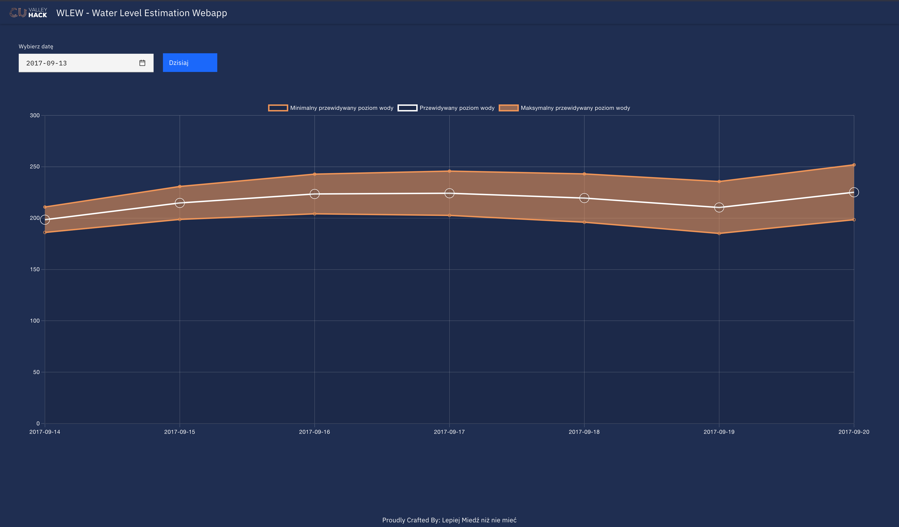

# WLEW - Water Level Estimation Webapp

Frontend aplikacji webowej, która pozwala na estymację poziomu wody na rzece Odrze na
podstawie opadów ze stacji pomiarowych.

## Dostęp do aplikacji

Aplikacja jest dostępna pod adresem: https://mf57.github.io/water-level-estimator-frontend/

## Wykorzystane technologie

* Angular 15
* SCSS
* Chart.JS

## Funkcjonalności aplikacji

Aplikacja wizualizuje estymowany poziom wody w rzece Odrze od zadanej daty przez kolejne
7 dni.

Biała linia wyznacza predykcję modelu, natomiast pomarańczowe pole niepewność predykcji.
Warto zauważyć, że im odleglejsza data, tym niepewność predykcji zwiększa się.

Datę można wybierać za pomocą datepickera. Obecnie możliwe do wybrania są wyłącznie daty z zakresu danych, które otrzymaliśmy, czyli
2012-01-01 do 2021-09-30

Jako, że przewidujemy iż najczęściej będzie podglądana predykcja od dnia dzisiejszego, to dodaliśmy przycisk 'Dzisiaj', który ustawia
zadaną datę na aktualny dzień. Ponieważ dzisiejszy dzień znajduje się poza zakresem dostarczonych danych, to przycisk 'Dzisiaj' ustawia datę 2017-09-13

